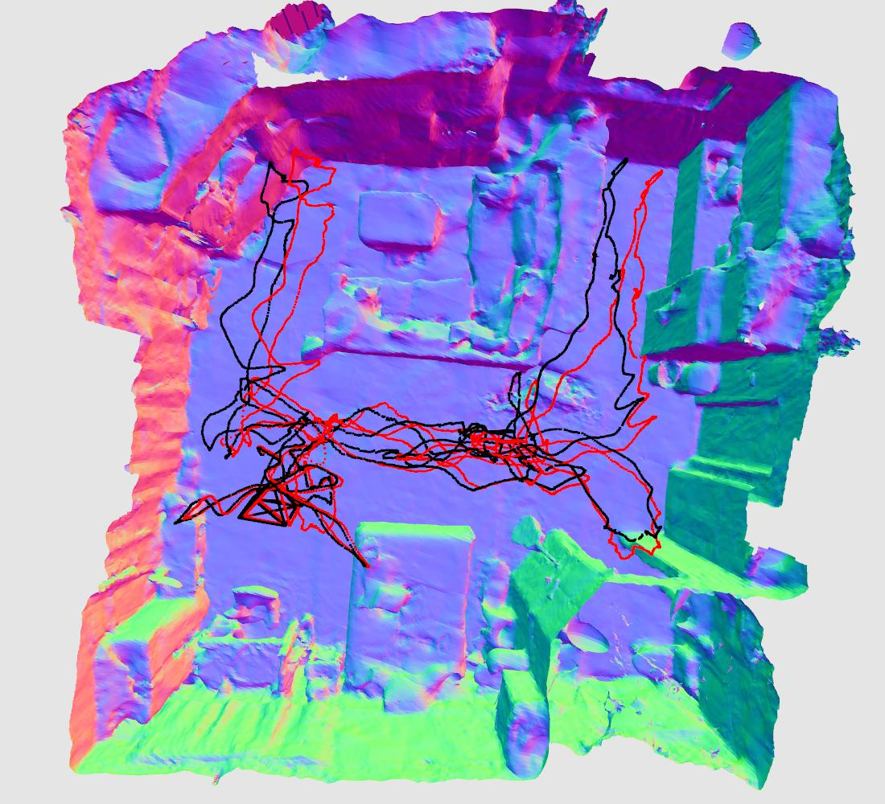
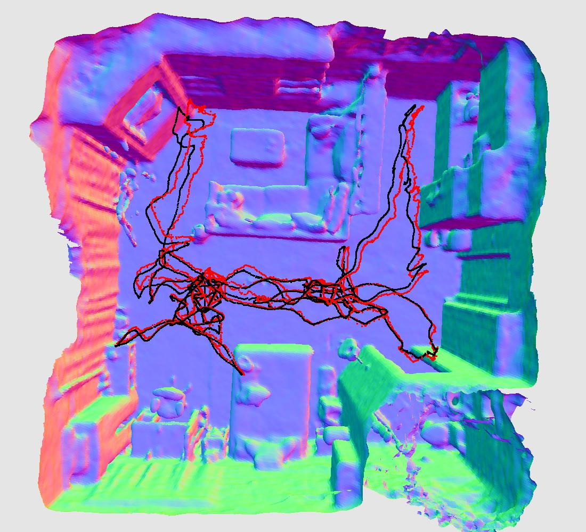

# ScanNet

|  Methods   | ATE↓ [cm] | ATE↓ w/o align [cm] | Track.↓ [ms x it] | Map.↓ [ms x it] | Track. FPS↑ | Map. FPS↑ | #param↓ |
|:----------:|:-------------:|:---------------------------:|:---------------------:|:-------------------:|:---------------:|:-------------:|:-------:|
|   iMAP*    |     36.67     |              -              |        30.4x50        |      44.9x300       |      0.66       |     0.07      |  0.2M   |
| NICE-SLAM  |     9.63      |            23.97            |        12.3x50        |      125.3x60       |      1.63       |     0.13      |  10.3M  |
| Vox-Fusion |     8.22      |              -              |        29.4x30        |       85.8x15       |      1.13       |     0.78      |  1.1M   |
|   ESLAM    |     7.42      |              -              |        7.4x30         |       22.4x30       |      4.54       |     1.49      |  10.5M  |
|  Co-SLAM   |     9.37      |            18.01            |        7.8x10         |       20.2x10       |      12.82      |     4.95      |  0.8M   |
|  Co-SLAM†  |     8.75      |              -              |        7.8x20         |       20.2x10       |      6.41       |     4.95      |  0.8M   |

For ScanNet scenes, we found that sometimes ATE RMSE with SE(3) alignment do not fully reflect the quality of tracking result:
In the example below (black: GT, red: estimated) the results on the left clearly has larger error drift than the one on the right, yet they have very close ATE RMSE: 8.64 vs 7.18.
Thus we also report the ATE RMSE with the raw estimated trajectory without doing SE(3) alignment for a reference.

  

The runtime is measured as the total processing time from the program starts until the final checkpoint is saved. 
Mesh saving was disabled for NICE-SLAM and iMAP* as we observed that they can take up to ~10 minutes to extract a single mesh.

### Scene0000_00

|  Methods   | ATE↓ [cm] | ATE↓ w/o align [cm] | runtime↓ | #param↓ | 
|:----------:|:-------------:|:---------------------------:|:--------:|:-------:|
|   iMAP*    |     55.95     |              -              | 6hr33min |  0.20M  |
| NICE-SLAM  |     8.64      |            25.24            | 2hr46min | 22.04M  |
| Vox-Fusion |     8.39      |              -              | 2hr15min |  1.18M  |
|   ESLAM    |     7.32      |              -              | 40min10s |  17.8M  |
|  Co-SLAM   |     7.18      |            12.94            | 14min35s |  1.59M  |
|  Co-SLAM†  |     7.13      |              -              | 20min40s |  1.59M  |

### Scene0059_00

|  Methods   | ATE↓ [cm] | ATE↓ w/o align [cm] | runtime↓ | #param↓ | 
|:----------:|:-------------:|:---------------------------:|:--------:|:-------:|
|   iMAP*    |     32.06     |              -              | 2hr10min |  0.20M  |
| NICE-SLAM  |     12.25     |            25.01            | 46min34s |  6.88M  |
| Vox-Fusion |     9.18      |              -              | 44min20s |  1.13M  |
|   ESLAM    |     8.55      |              -              | 12min24s |  8.40M  |
|  Co-SLAM   |     12.29     |            19.12            | 4min25s  |  0.13M  |
|  Co-SLAM†  |     11.14     |              -              | 6min30s  |  0.13M  |

### Scene0106_00

|  Methods   | ATE↓ [cm] | ATE↓ w/o align [cm] | runtime↓ | #param↓ | 
|:----------:|:-------------:|:---------------------------:|:--------:|:-------:|
|   iMAP*    |     17.50     |              -              | 2hr50min |  0.20M  |
| NICE-SLAM  |     8.09      |            10.40            | 1hr2min  | 11.07M  |
| Vox-Fusion |     7.44      |              -              | 1hr2min  |  1.10M  |
|   ESLAM    |     7.51      |              -              | 15min31s |  11.2M  |
|  Co-SLAM   |     9.57      |            12.12            | 5min50s  |  0.48M  |
|  Co-SLAM†  |     9.36      |              -              | 8min55s  |  0.48M  |

### Scene0169_00

|  Methods   | ATE↓ [cm] | ATE↓ w/o align [cm] | runtime↓ | #param↓ | 
|:----------:|:-------------:|:---------------------------:|:--------:|:-------:|
|   iMAP*    |     70.51     |              -              | 2hr25min |  0.20M  |
| NICE-SLAM  |     10.28     |            30.51            | 49min55s |  7.14M  |
| Vox-Fusion |     6.53      |              -              | 49min50s |  1.03M  |
|   ESLAM    |     6.51      |              -              | 13min37s |  8.58M  |
|  Co-SLAM   |     6.62      |            19.61            | 4min52s  |  1.59M  |
|  Co-SLAM†  |     5.90      |              -              | 7min40s  |  1.59M  |

### Scene0181_00

|  Methods   | ATE↓ [cm] | ATE↓ w/o align [cm] | runtime↓ | #param↓ | 
|:----------:|:-------------:|:---------------------------:|:--------:|:-------:|
|   iMAP*    |     32.10     |              -              | 2hr48min |  0.20M  |
| NICE-SLAM  |     12.93     |            39.98            |   1hr    |  6.90M  |
| Vox-Fusion |     12.20     |              -              |  46min   |  1.05M  |
|   ESLAM    |     9.21      |              -              | 15min57s |  8.48M  |
|  Co-SLAM   |     13.43     |            34.41            | 5min35s  |  0.48M  |
|  Co-SLAM†  |     11.81     |              -              | 8min20s  |  0.48M  |

### Scene0207_00

|  Methods   | ATE↓ [cm] | ATE↓ w/o align [cm] | runtime↓ | #param↓ | 
|:----------:|:-------------:|:---------------------------:|:--------:|:-------:|
|   iMAP*    |     11.91     |              -              | 2hr23min |  0.20M  |
| NICE-SLAM  |     5.59      |            12.70            | 49min5s  |  7.50M  |
| Vox-Fusion |     5.57      |              -              |  44min   |  1.10M  |
|   ESLAM    |     5.71      |              -              | 13min34s |  8.50M  |
|  Co-SLAM   |     7.13      |            9.88             | 4min40s  |  0.48M  |
|  Co-SLAM†  |     7.14      |              -              | 7min24s  |  0.48M  |

